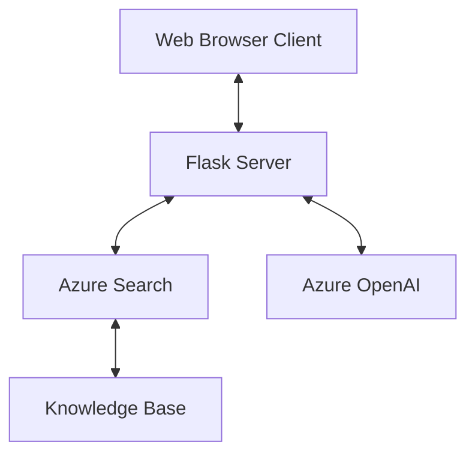
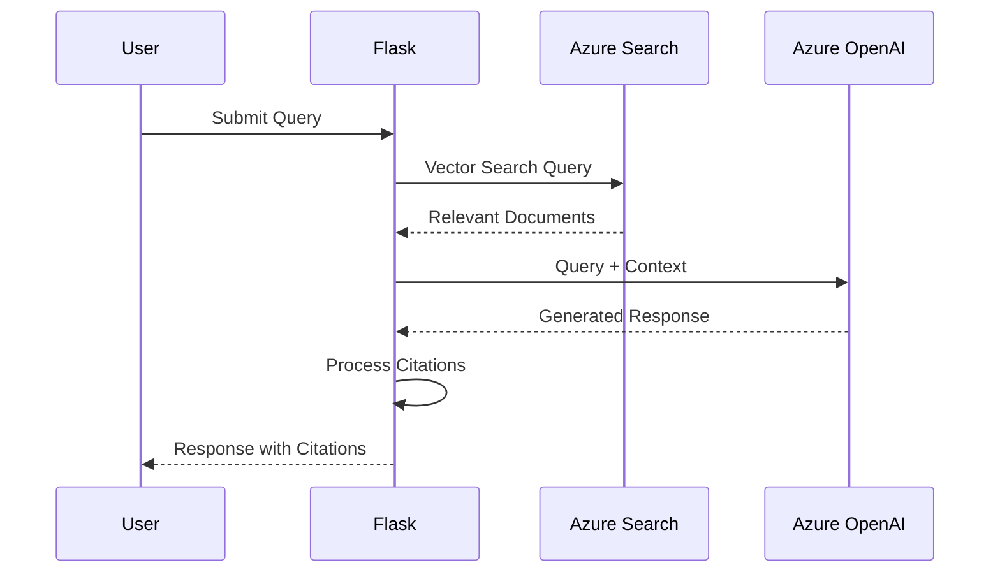

# System Patterns: Azure Search RAG Assistant

## System Architecture
The Azure Search RAG Assistant follows a client-server architecture with the following components:

## Key Design Patterns

### 1. Retrieval-Augmented Generation (RAG) Pattern
The core of the system follows the RAG pattern:
1. User query is processed
2. Relevant documents are retrieved from Azure Search
3. Retrieved documents are used as context for OpenAI to generate a response
4. Citations are managed to link responses to source material

### 2. Streaming Response Pattern
The system uses streaming responses to provide immediate feedback:
- Response is generated incrementally
- Chunks are sent to the client as they become available
- Client renders the response progressively

### 3. Model-View-Controller (MVC)
- **Model**: RAG Assistant and data handling logic
- **View**: HTML templates and JavaScript frontend
- **Controller**: Flask routes and API endpoints

### 4. Factory Pattern
The RAG Assistant uses a factory pattern to create and configure instances with different settings.

### 5. Strategy Pattern
Different search and response strategies can be configured through settings.

## Component Relationships

### Flask Application (main.py)
- Serves as the entry point and controller
- Handles HTTP requests and routes
- Renders HTML templates
- Provides API endpoints

### RAG Assistant (rag_assistant.py)
- Core business logic
- Manages interaction with Azure services
- Processes queries and generates responses
- Handles citation management

### Frontend (HTML/JavaScript)
- Provides user interface
- Manages chat state
- Handles streaming responses
- Provides settings configuration

## Critical Implementation Paths

### Query Processing Path
1. User submits query through web interface
2. Query is sent to `/api/stream_query` endpoint
3. RAG Assistant processes the query
4. Vector search retrieves relevant documents
5. Context is prepared with retrieved documents
6. OpenAI generates a response with the context
7. Response is streamed back to the client
8. Citations are processed and displayed

### Settings Configuration Path
1. User opens settings drawer
2. User configures system prompt and model parameters
3. Settings are saved to localStorage
4. Settings are sent with subsequent queries
5. RAG Assistant applies settings to response generation

### Developer Evaluation Path
1. User toggles Developer Mode
2. System prompts for evaluation parameters
3. Query is processed with specified parameters
4. Results are displayed with evaluation metrics
5. Reports can be downloaded for further analysis
